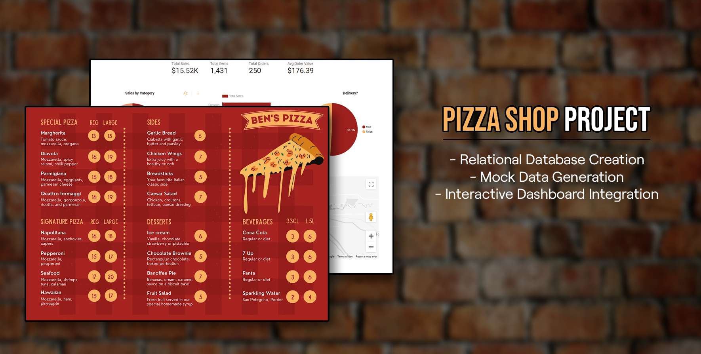

# Pizza Shop Data Dashboard 🍕

---

# Overview

In this data implementation project, I created a relational database from scratch to fulfill the needs of a hypothetical pizza company looking to take a deeper look into their order trends, inventory levels, and staff costs.

By combining manual record creation in Excel, mock data generated from Mockaroo using data within the schema, as well as the Data Generation Tool in Navicat - I was able to create a functional database and build a dashboard via Google's Looker Studio based off custom query usage.

#### Tools Used
- [QuickDBD](https://www.quickdatabasediagrams.com/)
- [Mockaroo](https://www.mockaroo.com/)
- [Google Cloud SQL](https://cloud.google.com/sql)
- [Google Looker Studio](https://cloud.google.com/looker-studio)
- **Microsoft Excel**
- **Navicat RDBMS + Navicat Data Generation Tool**

---

# Project Goals
1. **Create a Relational SQL Database** 
      - Design a functional and normalized database to suit the needs of a pizza company. This needed to support order details, customer information, inventory information, as well as staff and pertinent shift data.
      - Once created, populate the database with mock data created with various tools. This data would later be used to simulate BI analytics derived from a dashboard built using Looker Studio.

2. **Write Custom SQL Queries**
      - Custom SQL queries were created as views and plugged into Looker Studio as custom metrics. These allowed me to look at important analytics (such as *orders/sales by hour*, *orders broken down by delivery/pick-up*, and *inventory P/L*).
      - These queries can be viewed in `\Queries\`.

3. **Build An Interactive Dashboard**
      - After creating queries to fulfill custom metrics, the database and views were uploaded to Google Cloud Studio and a custom dashboard was built. This allowed me to breakdown the data and take a look at some of the following insights:
        -  *Average Order Price*
        -  *Hourly Order Trends*
        -  *Total Ingredient Cost*
---

# Dashboard Results

📊 [Dashboard Link | Looker Studio](https://lookerstudio.google.com/reporting/5c6ffffa-7c8f-4896-9362-e7303760b123)

#### *What is the average order value, and which is the most popular order type: pick-up or delivery?*
- Based on the dataset, it was found that the average value of all 250 orders was **$176.39**. The majority of orders, accounting for **52.8%** of the dataset, were made as delivery orders, while the remaining **47.2%** were made as pick-up orders. Although there seems to be a relatively even distribution between the two types of orders, it may be possible for the company to consider offering exclusive pick-up deals to balance out this metric.

#### *What pizza has sold the most, and how much revenue did it generate? How much does it cost to make, and is it our most expensive?*
- The most popular pizzais the "Diavola Pizza", which generated a total revenue of **$2,131.00** across all orders. Interestingly, despite its popularity, it is the 12th cheapest pizza in terms of ingredient cost, at **$2.64** per pizza. This pizza also happens to be the second most expensive option on the menu, indicating that the company is likely making a significant profit from this particular customer favorite.

#### *What was the highest amount of sales generated in any given hour? How many orders did this include?*
- Within the dataset, the hour that generated the highest revenue was 11 PM, with a total of **$1,068** in sales. Interestingly, this hour only consisted of 11 orders, which is relatively low. This finding suggests that the company may have experienced a string of high-value orders during that specific hour, which helped to boost their overall sales performance. It also highlights the potential importance of analyzing sales data at a granular level, as individual hours or even orders can have a significant impact on overall revenue.

---
  
# Summary

> The concept of this project was to be an all-inclusive, yet accurate representation of the data analysis process.
> 
> *QuickDBD* was an essential tool for designing the database schema, allowing me to map out the structure of the database and define relationships between tables quickly. Integrating data I created in Excel alongside *Mockaroo*, I learned how to generate realistic test data to populate the database and ensure that it accurately reflects a real-world scenario. 
> 
> Once the database and records were generated, *Google Cloud SQL* provided a reliable, scalable database solution that was easy to manage, and I learned how to create and manage virtual database instances as well as monitor performance. *Google Looker Studio* was a powerful platform that provided an extensive suite of tools for data analytics and visualization. Throughout my work with Looker Studio, I learned how to create customized dashboards and reports that allowed me to present data in a visually compelling way. With Looker Studio's user-friendly interface, I was able to define specific metrics that were relevant to my project and create dimensions that allowed me to analyze data in various ways
>
> Overall, I learned that each tool in this data project played an essential role in the data analysis process, and that they were all interconnected. With these tools, I was able to design, populate, manage, analyze, and visualize the data, gaining deep insights that helped me to make informed decisions. I also learned that data analysis is an iterative process and that these tools can help to streamline the process and improve the accuracy and usefulness of the results.
---
